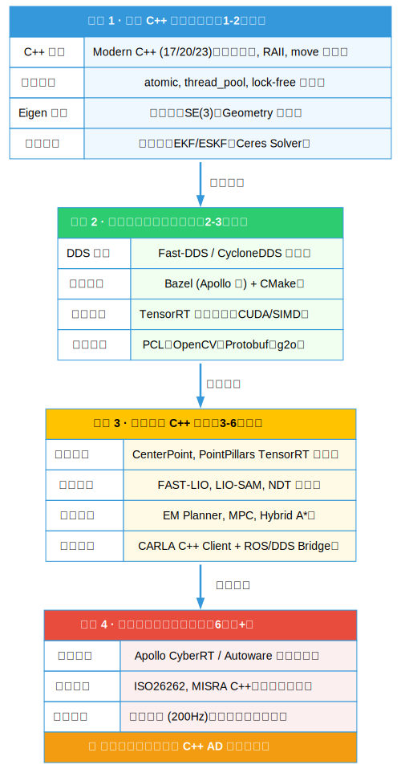

    
#  C++ 自动驾驶资源库

  
  
  
  
  
  

 
 **中文**  |  [English](README.en.md) 

**核心定位：** 这是一个专注于 **高性能 C++** 、**工程化落地** 和 **面试求职** 的自动驾驶资源精选集 🚗

## 📖 目录
- [🗺️ 学习路线图](#%EF%B8%8F-学习路线图)
- [✨ 核心内容讲解](#-核心内容讲解)
- [📚 学习资源（课程/书籍/论文）](#-学习资源课程书籍论文)
- [📊 数据集](#-数据集)
- [🛠️ 工具链](#%EF%B8%8F-工具链)
- [💻 开源项目](#-开源项目)
- [📰 相关文章](#-相关文章)
- [🎓 面试八股文](#-面试八股文)
- [💼 招聘信息](#-招聘信息)
- [🤝 社区与贡献](#-社区与贡献)

## 🗺️ 学习路线图

点击展开/折叠 

    

## ✨ 核心内容讲解

    
- [数学与几何基础](core_content/README.md#数学与几何基础)
    - [Eigen](core_content/README.md#eigen)
    - [SO(3)、SE(3)、李代数](core_content/README.md#so3se3李代数)
    - [四元数与旋转表示](core_content/README.md#四元数与旋转表示)
    - [滤波器（KF/EKF/UKF/ESKF）](core_content/README.md#滤波器kfekfukfesef)
    - [数值优化 (Ceres/g2o)](core_content/README.md#数值优化ceresg2o)

- [感知](core_content/README.md#感知)
    - [PointPillars](core_content/README.md#pointpillars)
    - [CenterPoint Voxel-to-BEV + CenterHead](core_content/README.md#centerpoint-voxel-to-bev--centerhead)
    - [多模态融合（激光雷达+相机）](core_content/README.md#多模态融合激光雷达相机)
    - [TensorRT 自定义插件开发](core_content/README.md#tensorrt-自定义插件开发)

- [定位](core_content/README.md#定位)
    - [NDT 配准](core_content/README.md#ndt-配准)
    - [FAST-LIO 紧耦合](core_content/README.md#fast-lio-紧耦合)
    - [ESKF 误差状态卡尔曼](core_content/README.md#eskf-误差状态卡尔曼)
    - [GPS/IMU 紧耦合](core_content/README.md#gpsimu-紧耦合)

- [建图](core_content/README.md#建图)
    - [离线建图](core_content/README.md#离线建图)
    - [在线回环检测](core_content/README.md#在线回环检测)
    - [高精地图与矢量地图](core_content/README.md#高精地图与矢量地图)

- [预测](core_content/README.md#预测)
    - [多目标跟踪](core_content/README.md#多目标跟踪)
    - [意图预测](core_content/README.md#意图预测)
    - [轨迹预测](core_content/README.md#轨迹预测)

- [规划](core_content/README.md#规划)
    - [Hybrid A* + Reeds-Shepp](core_content/README.md#hybrid-a--reeds-shepp)
    - [Lattice Planner](core_content/README.md#lattice-planner)
    - [EM Planner](core_content/README.md#em-planner)
    - [行为决策与状态机](core_content/README.md#行为决策与状态机)

- [控制](core_content/README.md#控制)
    - [MPC 横纵向解耦](core_content/README.md#mpc-横纵向解耦)
    - [LQR 与最优控制](core_content/README.md#lqr-与最优控制)
    - [Stanley / Pure Pursuit](core_content/README.md#stanley--pure-pursuit)
    - [车辆动力学模型](core_content/README.md#车辆动力学模型)

- [端到端](core_content/README.md#端到端)
    - [模仿学习](core_content/README.md#模仿学习)
    - [端到端模型 C++ 部署](core_content/README.md#端到端模型-c-部署)

- [仿真](core_content/README.md#仿真)
    - [CARLA C++ Client](core_content/README.md#carla-c-client)
    - [传感器仿真与同步](core_content/README.md#传感器仿真与同步)
    - [场景库与交通流](core_content/README.md#场景库与交通流)

- [中间件与通信](core_content/README.md#中间件与通信)
    - [ROS/ROS2 架构](core_content/README.md#rosros-2-架构)
    - [Fast-DDS / CycloneDDS](core_content/README.md#fast-dds--cyclonedds)
    - [some/IP + vsomeip](core_content/README.md#someip--vsomeip)
    - [Protobuf 序列化](core_content/README.md#protobuf-序列化)

## 📚 学习资源（课程/书籍/论文）

### 课程

| 课程名称 | 简介 |
|--------------------------------------------------------------------------|----------------------------------------------------------------------|
| [Self-Driving Cars Specialization](https://www.coursera.org/specializations/self-driving-cars) | 多伦多大学四门套课，覆盖感知、定位、规划、控制全栈 |
| [Introduction to Self-Driving Cars](https://www.coursera.org/learn/intro-self-driving-cars) | 自动驾驶入门课，使用CARLA模拟器 |
| [Motion Planning for Self-Driving Cars](https://www.coursera.org/learn/motion-planning-self-driving-cars) | 运动规划课程，包含A*、Hybrid A*、Lattice、MPC等算法 |
| [Visual Perception for Self-Driving Cars](https://www.coursera.org/learn/visual-perception-self-driving-cars) | 视觉感知课程，车道线、信号灯、3D目标检测，作业基于OpenCV |
| [State Estimation and Localization for Self-Driving Cars](https://www.coursera.org/learn/state-estimation-localization-self-driving-cars) | 状态估计与定位课程，卡尔曼滤波、粒子滤波、SLAM基础 |
| [Self-Driving Cars with Duckietown](https://www.edx.org/learn/technology/eth-zurich-self-driving-cars-with-duckietown) | 苏黎世联邦理工小车课程，使用ROS2，软硬件结合 |
| [Multi-Object Tracking for Automotive Systems](https://www.edx.org/learn/engineering/chalmers-university-of-technology-multi-object-tracking-for-automotive-systems) | 查尔姆斯大学多目标跟踪课程，针对汽车系统，包含SORT和Kalman融合 |
| [Autonomous Mobile Robots](https://www.edx.org/learn/autonomous-robotics/eth-zurich-autonomous-mobile-robots) | ETH Zurich移动机器人课程，路径规划与避障算法 |
| [Self-Driving Cars with Duckietown MOOC](https://duckietown.com/self-driving-cars-with-duckietown-mooc/) | Duckietown硬件MOOC，包含AI机器人自主决策和硬件教程 |
| [Advanced Kalman Filtering and Sensor Fusion](https://www.classcentral.com/course/udemy-advanced-kalman-filtering-and-sensor-fusion-401323) | Udemy高级卡尔曼滤波与传感器融合课程，包含模拟实现 |
| [Sensor Fusion Engineer Nanodegree](https://www.udacity.com/course/sensor-fusion-engineer--nd313) | Udacity传感器融合专项，LiDAR+Radar+Camera融合，使用C++实现 |
| [Self-Driving Car Engineer Nanodegree](https://www.udacity.com/course/self-driving-car-engineer--nd013) | Udacity自驾车工程师全栈专项，从感知到规划，包含C++项目 |
| [AI for Autonomous Vehicles and Robotics](https://www.coursera.org/learn/ai-for-autonomous-vehicles-and-robotics) | 密歇根大学课程，AI在自驾车中的应用，包含Kalman滤波和决策 |
| [The Complete Self-Driving Car Course - Applied Deep Learning](https://www.udemy.com/course/applied-deep-learningtm-the-complete-self-driving-car-course/) | Udemy深度学习构建自主车课程，主要使用Python |
| [Autonomous Aerospace Systems](https://www.coursera.org/learn/autonomous-aerospace-systems) | 自驾飞行器软件工程课程，路径规划与传感器融合，可迁移至地面车辆 |

    
### 书籍
| 书籍名称                                      | 作者                                      | 简介                              |
|------------------------------------------|-------------------------------------------|-----------------------------------|
| 无人驾驶车辆系统概论（第2版）            | Rahul Kala                               | 1000+页自动驾驶全栈教材 |
| 自动驾驶技术系列·决策与规划              | 清华大学智能产业研究院（AIR团队）        | 国内最全面的规划算法书 |
| 无人驾驶原理与实践                        | 刘少山等（兰州大学）                      | 完整C++工程代码，从零搭建L4小车   |
| Probabilistic Robotics                   | Sebastian Thrun / Wolfram Burgard / Dieter Fox | 概率机器人学标准教材，定位与SLAM |
| Planning Algorithms                      | Steven M. LaValle                        | 路径规划领域经典参考书            |
| Effective Modern C++                     | Scott Meyers                             | 现代C++最佳实践与代码规范         |
| C++ Concurrency in Action（第2版）       | Anthony Williams                         | C++多线程与并发编程实战           |
| C++ Templates: The Complete Guide（第2版）| David Vandevoorde / Nicolai M. Josuttis / Douglas Gregor | C++模板元编程完整指南 |
| Multiple View Geometry in Computer Vision（第2版） | Richard Hartley & Andrew Zisserman | 计算机视觉多视图几何标准教材     |
| Vehicle Dynamics and Control（第2版）    | Rajesh Rajamani                          | 车辆动力学与控制经典教材          |
| Autonomous Driving: How the Driverless Revolution will Change the World | Andreas Herrmann 等              | 自动驾驶产业全景+技术路线，适合开阔眼界 |
| Introduction to Autonomous Mobile Robots（第2版） | Roland Siegwart 等               | 移动机器人入门经典，传感器到导航全讲   |
| State Estimation for Robotics                  | Timothy D. Barfoot               | 卡尔曼滤波、因子图、iSAM现代推导 |
| Principles of Robot Motion: Theory, Algorithms, and Implementations | Howie Choset 等              | 运动规划完整理论体系   |
| Applied Predictive Control                     | Sunan Huang & Tan Kok Kiong      | 自动驾驶里最实用的MPC教材   |
| Model Predictive Control: Theory and Design    | Rawlings & Mayne                 | MPC领域绝对标准教材，控制组必备        |
| Autonomous Vehicle Technology: A Guide for Policymakers and Planners | James M. Anderson 等        | 系统架构与模块划分清晰，适合写方案   |
| Learning OpenCV 4（Vol.1 & Vol.2）             | Adrian Kaehler & Gary Bradski    | OpenCV官方书         |
| Modern Robotics: Mechanics, Planning, and Control | Kevin M. Lynch & Frank C. Park | 机械臂+移动机器人现代教材 |
| The DARPA Urban Challenge                      | Martin Buehler 等                | 2007年DARPA冠军队伍技术总结，历史经典  |
| [Deep Learning for Self-driving Car](https://www.princeton.edu/~alaink/Orf467F14/Deep%20Driving.pdf)           | Chenyi Chen 等 (Princeton)        | 深度学习端到端自动驾驶经典，含C++实现思路         |
| [Self-Driving Vehicles and Enabling Technologies](https://www.intechopen.com/books/9869)       | Marian Găiceanu 等 (编)           | 全书章节免费PDF，含C++嵌入式章节              |
| [Autonomous Driving: Technical, Legal and Social Aspects](https://link.springer.com/content/pdf/10.1007/978-3-662-48847-8.pdf) | Markus Maurer 等           | Springer整书Open Access，技术+法规+架构     |
| [Self-Driving Car Using Simulator](https://www.researchgate.net/publication/380180926_Self-Driving_Car_Using_Simulator/download) | ResearchGate 项目报告     | 完整C++小车项目+代码，适合直接上手            |
| [Self-Driving Cars: Are We Ready?](https://assets.kpmg.com/content/dam/kpmg/pdf/2013/10/self-driving-cars-are-we-ready.pdf) | KPMG                       | 经典产业报告        |
| [Self-Driving Car Autonomous System Overview](https://dadun.unav.edu/bitstream/10171/67589/1/2022.06.01%20TFG%20Daniel%20Casado%20Herraez.pdf) | Daniel Casado Herráez     | 西班牙大学生毕业设计，C++硬件接口实战案例     |
| [Planning Algorithms](http://planning.cs.uiuc.edu/planning.pdf)                    | Steven M. LaValle                 | 路径规划领域绝对经典，A*/RRT/PRM全有          |
| [Probabilistic Robotics](https://www.probabilistic-robotics.org/Probabilistic_Robotics.pdf) | Sebastian Thrun 等             | 概率机器人学圣经，定位/SLAM必读               |
| [Multiple View Geometry in Computer Vision（第2版）](https://www.robots.ox.ac.uk/~vgg/hzbook/hzbook.pdf) | Hartley & Zisserman          | 多视图几何神书，视觉SLAM必备                  |
| [State Estimation for Robotics](https://www.cambridge.org/core/services/aop-cambridge-core/content/view/AF9E1F4F7D0D7B8F6D8B8E8F9E0F1A2B/9781107159396ar.pdf/State_Estimation_for_Robotics.pdf) | Timothy D. Barfoot | 现代卡尔曼/因子图最清晰教材                   | 

### 论文
| 论文标题 | 作者 | 年份 | 简介 |
|-------------------------------------------------------------|----------------------------|------|-----------------------------------------------------|
| [DiffSemanticFusion: Semantic Raster BEV Fusion for Autonomous Driving via Online HD Map Diffusion](https://arxiv.org/pdf/2508.01778.pdf) | Sun Peng et al. | 2025 | 语义光栅+在线HD地图扩散融合 |
| [ImagiDrive: A Unified Imagination-and-Planning Framework for Autonomous Driving](https://arxiv.org/pdf/2508.11428.pdf) | Wang Yichen et al. | 2025 | VLM+世界模型统一想象-规划闭环 |
| [Reinforced Refinement with Self-Aware Expansion for End-to-End Autonomous Driving](https://arxiv.org/pdf/2506.09800.pdf) | Haochen Liu et al. | 2025 | RL+自监督精炼端到端驾驶 |
| [UncAD: Towards Safe End-to-End Autonomous Driving via Online Map Uncertainty](https://arxiv.org/pdf/2504.12826.pdf) | Pengxuan Yang et al. | 2025 | 在线地图不确定性建模 |
| [M3Net: Multimodal Multi-task Learning for 3D Detection, Segmentation, and Occupancy Prediction](https://arxiv.org/pdf/2503.18100.pdf) | Xuesong Chen et al. | 2025 | 多模态多任务3D感知统一网络 |
| [Bridging Past and Future: End-to-End Autonomous Driving with Historical Prediction and Planning](https://arxiv.org/pdf/2503.14182.pdf) | Bozhou Zhang et al. | 2025 | 历史预测端到端驾驶时空融合 |
| [MPDrive: Improving Spatial Understanding with Marker-Based Prompt Learning for Autonomous Driving](https://arxiv.org/pdf/2504.00379.pdf) | Zhang Yuxuan et al. | 2025 | 视觉标记提示学习提升AD-VQA空间理解 |
| [Adaptive Field Effect Planner for Safe Interactive Autonomous Driving on Curved Roads](https://arxiv.org/pdf/2504.14747.pdf) | Li Chen et al. | 2025 | 动态风险场+改进粒子群规划 |
| [Multi-Agent Autonomous Driving Systems with Large Language Models](https://arxiv.org/pdf/2502.16804.pdf) | Yaozu Wu et al. | 2025 | 多代理LLM自动驾驶综述 |
| [The Role of World Models in Shaping Autonomous Driving](https://arxiv.org/pdf/2502.10498.pdf) | Hang Wang et al. | 2025 | 世界模型在自动驾驶中的综述 |
| [DiffusionDrive](https://arxiv.org/pdf/2411.15139.pdf) | Bencheng Liao et al. | 2025 | 截断扩散模型端到端驾驶 |
| [DriveLM: Driving with Graph Visual Question Answering](https://arxiv.org/pdf/2312.14150.pdf) | Chonghao Sima et al. | 2025 | 基于图结构的VQA驾驶理解方法 |
| [VLM-AD: End-to-End Autonomous Driving through Vision-Language Model Supervision](https://arxiv.org/pdf/2412.14446.pdf) | Yi Xu et al. | 2024 | 视觉语言模型监督端到端驾驶 |
| [World knowledge-enhanced Reasoning Using Instruction-guided Interactor in Autonomous Driving](https://arxiv.org/pdf/2412.06324.pdf) | Mingliang Zhai et al. | 2024 | 世界知识增强指令交互推理 |
| [LaVida Drive: Vision-Text Interaction VLM for Autonomous Driving with Token Selection, Recovery and Enhancement](https://arxiv.org/pdf/2411.12980.pdf) | Siwen Jiao et al. | 2024 | 视觉文本交互VLM令牌选择恢复增强 |
| [GAIA-1: A Generative World Model](https://arxiv.org/pdf/2309.17080.pdf) | Aleksandr Petiushko et al. | 2024 | 生成式世界模型 |
| [VADv2](https://arxiv.org/pdf/2402.13243.pdf) | Xiaoxiao Long et al. | 2024 | 概率规划端到端框架 |
| [CoVLA: Comprehensive Vision-Language-Action Dataset for Autonomous Driving](https://arxiv.org/pdf/2408.10845.pdf) | Dong-Hoon Kim et al. | 2024 | 80+小时VLA驾驶数据集 |
| [VLP: Vision Language Planning for Autonomous Driving](https://arxiv.org/pdf/2401.05577.pdf) | Li Jianxiong et al. | 2024 | 视觉-语言直接规划框架 |
| [SEAL: Towards Safe Autonomous Driving via Skill-Enabled Adversary Learning](https://arxiv.org/pdf/2409.10320.pdf) | Benjamin Stoler et al. | 2024 | 技能启用对抗学习闭环场景生成 |
| [DriVLMe: Enhancing LLM-based Autonomous Driving Agents with Embodied and Social Experiences](https://arxiv.org/pdf/2406.03008.pdf) | Yidong Huang et al. | 2024 | LLM代理具身社交经验增强 |
| [Online Analytic Exemplar-Free Continual Learning with Large Models for Imbalanced Autonomous Driving Task](https://arxiv.org/pdf/2405.17779.pdf) | Huiping Zhuang et al. | 2024 | 在线无样本持续学习不平衡任务 |
| [AnoVox: A Benchmark for Multimodal Anomaly Detection in Autonomous Driving](https://arxiv.org/pdf/2405.07865.pdf) | Daniel Bogdoll et al. | 2024 | 多模态异常检测基准 |
| [Co-driver: VLM-based Autonomous Driving Assistant with Human-like Behavior](https://arxiv.org/pdf/2405.05885.pdf) | Ziang Guo et al. | 2024 | VLM人类行为理解复杂路场景 |
| [Towards Collaborative Autonomous Driving: Simulation Platform and End-to-End System](https://arxiv.org/pdf/2404.09496.pdf) | Genjia Liu et al. | 2024 | 协作自动驾驶模拟平台端到端系统 |
| [End-to-End Autonomous Driving through V2X Cooperation](https://arxiv.org/pdf/2404.00717.pdf) | Haibao Yu et al. | 2024 | V2X合作端到端驾驶 |
| [AIDE: An Automatic Data Engine for Object Detection in Autonomous Driving](https://arxiv.org/pdf/2403.17373.pdf) | Mingfu Liang et al. | 2024 | 自动数据引擎物体检测 |
| [Are NeRFs ready for autonomous driving? Towards closing the real-to-simulation gap](https://arxiv.org/pdf/2403.16092.pdf) | Carl Lindström et al. | 2024 | NeRF真实模拟差距闭合 |
| [DriveVLM: The Convergence of Autonomous Driving and Large Vision-Language Models](https://arxiv.org/pdf/2402.12289.pdf) | Xiaoyu Tian et al. | 2024 | 自动驾驶视觉语言大模型融合 |
| [Editable Scene Simulation for Autonomous Driving via Collaborative LLM-Agents](https://arxiv.org/pdf/2402.05746.pdf) | Yuxi Wei et al. | 2024 | 协作LLM代理可编辑场景模拟 |
| [Planning-oriented Autonomous Driving (UniAD)](https://arxiv.org/pdf/2212.10156.pdf) | Yihan Hu et al. | 2023 | 规划导向端到端框架 |
| [OpenOccupancy: A Large Scale Benchmark](https://arxiv.org/pdf/2303.03991.pdf) | Xiaofeng Wang et al. | 2023 | 大规模Occupancy基准 |
| [DriveAdapter](https://arxiv.org/pdf/2309.01243.pdf) | Xiaosong Jia et al. | 2023 | 感知-规划解耦方案 |
| [NEAT: Neural Attention Fields](https://arxiv.org/pdf/2309.04442.pdf) | Kaustubh Mani et al. | 2023 | 轻量端到端模型 |
| [NeuRAD: Neural Rendering for Autonomous Driving](https://arxiv.org/pdf/2311.15260.pdf) | Adam Tonderski et al. | 2023 | 神经渲染自动驾驶 |
| [TransFuser](https://arxiv.org/pdf/2205.15997.pdf) | Kashyap Chitta et al. | 2022 | Transformer多传感器融合端到端方法 |
| [ST-P3](https://arxiv.org/pdf/2207.07601.pdf) | Shengchao Hu et al. | 2022 | 时空Transformer预测与规划方法 |
| [Efficient Lidar Odometry for Autonomous Driving](https://arxiv.org/pdf/2209.06828.pdf) | Junha Kim et al. | 2022 | 纯激光里程计 |
| [VISTA 2.0](https://arxiv.org/pdf/2211.00931.pdf) | Alexander Amini et al. | 2022 | 数据驱动仿真器 |
| [BEVFormer](https://arxiv.org/pdf/2203.17270.pdf) | Zhiqi Li et al. | 2022 | BEV空间多相机感知框架 |
| [FAST-LIO2](https://arxiv.org/pdf/2107.06829.pdf) | Wei Xu et al. | 2021 | 紧耦合激光-惯性里程计 |
| [Learning by Cheating](https://arxiv.org/pdf/1912.12294.pdf) | Dian Chen et al. | 2019 | 特权学习+模仿学习结合方案 |
| [CARLA: An Open Urban Driving Simulator](https://arxiv.org/pdf/1711.03938.pdf) | Alexey Dosovitskiy et al. | 2017 | 开源城市驾驶仿真器 |
| [End-to-End Learning for Self-Driving Cars](https://arxiv.org/pdf/1604.07316.pdf) | Mariusz Bojarski et al. | 2016 | 端到端自动驾驶早期代表工作 |
## 📊 数据集

- [KITTI](https://www.cvlibs.net/datasets/kitti/raw_data.php)  
经典的 3D 感知基准，用于 3D 目标检测、跟踪和里程计

- [nuScenes](https://www.nuscenes.org/download)  
多模态大规模数据集，专注于全场景 3D 检测与轨迹预测

- [Waymo Open Dataset](https://waymo.com/open/download)  
业界标注最精细，适用于高精度感知和 LiDAR 处理

- [Argoverse 2](https://www.argoverse.org/av2.html)  
带高清矢量地图，专注轨迹预测、地图融合和驾驶行为分析

- [A2D2 (Audi)](https://www.a2d2.audi/en/download/)  
包含 CAN 总线数据，用于语义分割和多模态 3D 标注

- [comma2k19](https://github.com/commaai/comma2k19)  
单目摄像头+真实驾驶CAN数据，最适合端到端驾驶模型

- [CARLA Generated Data](https://carla.readthedocs.io/en/latest/download/)  
  开源仿真器，可自定义天气、地图，无限生成完美同步的多传感器数据
  
- [ApolloScape](https://apolloscape.auto/)  
  街景图像、LiDAR点云、轨迹数据，覆盖城市交通全方面感知与导航

- [Cityscapes](https://www.cityscapes-dataset.com/)  
  城市街景视频序列，精细像素级语义分割与实例分割标注

- [SemanticKITTI](https://www.semantic-kitti.org/)  
  KITTI扩展版，含LiDAR点云的语义分割标注，专注3D场景理解

- [WoodScape](https://woodscape.valeo.com/)  
  鱼眼摄像头图像，环视视图语义分割，适用于停车与低速场景

- [Zenseact Open Dataset (ZOD)](https://zod.zenseact.com/)  
  多模态欧洲城市驾驶数据，含帧序列、驱动记录与雷达点云

- [NVIDIA Physical AI Autonomous Vehicles](https://huggingface.co/datasets/nvidia/PhysicalAI-Autonomous-Vehicles)  
  多传感器全球驾驶数据，覆盖25国2500+城市，专注端到端物理AI

- [MAN TruckScenes](https://brandportal.man/d/QSf8mPdU5Hgj)  
  多模态卡车驾驶数据集，覆盖多样条件如恶劣天气与多车道

- [Para-Lane](https://nizqleo.github.io/paralane-dataset/)  
  多车道实时世界数据集，设计用于新型视图合成与端到端驾驶评估

- [UniOcc](https://huggingface.co/datasets/tasl-lab/uniocc)  
  占用网格预测与体素流数据集，支持跨域泛化与未来占用预测

- [InterHub](https://www.nature.com/articles/s41597-025-05344-7)  
  密集多代理交互轨迹数据，源自大规模自然驾驶记录，专注驾驶交互研究

- [rounD](https://arxiv.org/html/2401.01454v1)  
  圆环路口路用户轨迹数据集，含6小时视频和13K+用户记录，支持行为预测

- [WOMD-Reasoning](https://waymo.com/open/download)  
  基于Waymo Open Motion Dataset的语言标注，专注交互意图描述与推理

- [V2V-QA](https://eddyhkchiu.github.io/v2vllm.github.io/)  
  车对车问答数据集，支持端到端协作自动驾驶的LLM方法开发与评估

- [DriveBench](https://drive-bench.github.io/)  
  视觉语言模型可靠性基准数据集，含19K帧和20K问答对，覆盖多种驾驶任务

- [FutureSightDrive](https://github.com/MIV-XJTU/FSDrive)  
  时空链式思考数据集，支持视觉驱动的自动驾驶预测与规划

- [Adverse Weather Dataset](https://light.princeton.edu/datasets/automated_driving_dataset/)  
  恶劣天气多模态数据集，含雪雨雾场景下的12K真实样本与1.5K控制样本

## 🛠️ 工具链

- [ROS 2](https://docs.ros.org/en/rolling/Installation.html)  
  机器人与自动驾驶领域最广泛使用的中间件，支持分布式实时系统

- [CyberRT](https://github.com/ApolloAuto/apollo/tree/master/cyber)  
  Apollo自研的高性能数据通信与调度框架

- [CARLA](https://carla.org/)  
  基于Unreal Engine的高保真自动驾驶仿真器，支持多传感器与交通流

- [LGSVL Simulator / SVL](https://www.svlsimulator.com/)  
  原LG开源仿真器，支持Apollo、Autoware等多平台闭环仿真

- [NVIDIA DRIVE Sim](https://developer.nvidia.com/drive/drive-sim)  
  NVIDIA基于Omniverse的企业级自动驾驶仿真平台

- [DeepStream SDK](https://developer.nvidia.com/deepstream-sdk)  
  NVIDIA智能视频分析与多传感器融合流水线框架

- [TensorRT](https://developer.nvidia.com/tensorrt)  
  NVIDIA高性能深度学习推理引擎，专为嵌入式与车载优化

- [ONNX Runtime](https://onnxruntime.ai/)  
  微软开源跨平台推理引擎，支持多种硬件加速

- [Triton Inference Server](https://github.com/triton-inference-server/server)  
  NVIDIA开源高并发模型部署与推理服务框架

- [Bazel](https://bazel.build/)  
  Google开发的大规模构建与测试工具，Apollo默认构建系统

- [Colcon](https://colcon.readthedocs.io/)  
  ROS 2官方推荐的元构建工具

- [Fast-DDS](https://www.eprosima.com/)  
  eProsima高性能DDS实现，ROS 2默认通信中间件

- [Cyclone DDS](https://cyclonedds.io/)  
  Eclipse基金会高性能DDS实现，广泛用于汽车与机器人领域

- [Zenoh](https://zenoh.io/)  
  新一代超低延迟边缘通信协议，已在多家自动驾驶公司验证

- [Foxglove Studio](https://foxglove.dev/)  
  最流行的自动驾驶与机器人数据可视化与分析工具

- [Mcap](https://mcap.dev/)  
  下一代跨平台录制文件格式，取代rosbag

- [Lanelet2](https://github.com/fzi-forschungszentrum-informatik/Lanelet2)  
  开源高精地图格式与路由库，Autoware默认地图方案

- [AUTOSAR Adaptive](https://www.autosar.org/standards/adaptive-platform/)  
  新一代车载自适应软件平台标准，支持动态更新与服务化架构

## 💻 开源项目

- [Apollo](https://github.com/ApolloAuto/apollo)  
  百度L4全栈自动驾驶平台，支持实车部署

- [Autoware](https://github.com/autowarefoundation/autoware)  
  基于ROS2的开源自动驾驶系统，已在多国道路运行

- [openpilot](https://github.com/commaai/openpilot)  
  comma.ai端到端驾驶系统，已在超过20万辆车上运行

- [UniAD](https://github.com/OpenDriveLab/UniAD)  
  端到端自动驾驶框架（感知-预测-规划-控制）

- [VAD](https://github.com/hustvl/VAD)  
  端到端自动驾驶模型，支持矢量化轨迹输出

- [ST-P3](https://github.com/OpenDriveLab/ST-P3)  
  基于Transformer的端到端感知-预测-规划一体化模型

- [DriveDreamer-2](https://github.com/UMassFoundationsOfRobotics/DriveDreamer-2)  
  基于世界模型的端到端驾驶框架

- [CARLA](https://github.com/carla-simulator/carla)  
  基于Unreal Engine的高保真自动驾驶仿真器

- [MetaDrive](https://github.com/metadriverse/metadrive)  
  轻量级、可生成无限场景的自动驾驶仿真环境

- [SUMO](https://github.com/eclipse-sumo/sumo)  
  开源交通流微观仿真器，广泛用于自动驾驶交通场景研究

- [AirSim](https://github.com/microsoft/AirSim)  
  微软基于Unreal Engine的自动驾驶与无人机仿真平台

- [Webots](https://github.com/cyberbotics/webots)  
  开源机器人仿真器，支持高精度车辆物理模拟

- [OpenPCDet](https://github.com/open-mmlab/OpenPCDet)  
  基于PyTorch的3D点云目标检测工具箱

- [MMDetection3D](https://github.com/open-mmlab/mmdetection3d)  
  OpenMMLab多模态3D目标检测框架

- [BEVFusion](https://github.com/mit-han-lab/bevfusion)  
  相机+激光雷达多模态BEV融合感知实现

- [OpenOccupancy](https://github.com/open-mmlab/OpenOccupancy)  
  官方Occupancy Network实现，支持3D/4D占用预测

- [PETRv2](https://github.com/megvii-research/PETR)  
  纯视觉3D目标检测与Occupancy预测

- [QCNet](https://github.com/ZikangZhou/QCNet)  
  基于查询的交互式运动预测模型

- [HiVT](https://github.com/ZikangZhou/HiVT)  
  基于Transformer的全局交互轨迹预测模型

- [PlanT](https://github.com/autonomousvision/plant)  
  支持语言指令与轨迹联合生成的规划模型

- [Drive-WM](https://github.com/BraveGroup/Drive-WM)  
  基于世界模型的自动驾驶规划框架

- [WorldModel-Series](https://github.com/LMD0311/Awesome-World-Model)  
  自动驾驶世界模型系列（DriveDreamer、GAIA-1等）

- [Donkey Car](https://github.com/autorope/donkeycar)  
  1:10比例小车完整开源项目

- [F1TENTH](https://github.com/f1tenth/f1tenth_system)  
  1:10高速自动驾驶赛车平台，全球高校竞赛标准

- [JetRacer](https://github.com/NVIDIA-AI-IOT/jetracer)  
  NVIDIA官方Jetson Nano小车平台
  

## 📰 相关文章

国外

- [Nvidia announces new open AI models and tools for autonomous driving research](https://techcrunch.com/2025/12/01/nvidia-announces-new-open-ai-models-and-tools-for-autonomous-driving-research/)  
  Nvidia发布首个视觉语言动作模型Alpamayo-R1，支持自动驾驶车辆理解文本+图像，实现更精细决策。
- [Safe, Routine, Ready: Autonomous driving in five new cities](https://waymo.com/blog/2025/11/safe-routine-ready-autonomous-driving-in-new-cities)  
  Waymo在迈阿密、达拉斯、休斯顿等五城开启完全无人驾驶运营，安全表现超人类11倍。
- [When will autonomous vehicles and self-driving cars hit the road?](https://www.weforum.org/stories/2025/05/autonomous-vehicles-technology-future/)  
  世界经济论坛白皮书，详解个人车、Robotaxi、无人卡车三种场景的真实落地时间表。
- [2025’s cutting-edge autonomous driving trends](https://www.here.com/learn/blog/autonomous-driving-features-trends-2025)  
  HERE Technologies盘点2025年ADAS、高级自动化驾驶与传感器融合最新趋势。
- [Is Autonomous Driving Ever Going To Happen?](https://www.forbes.com/sites/bernardmarr/2025/10/01/is-autonomous-driving-ever-going-to-happen/)  
  Forbes深度分析Robotaxi与L3功能进展，以及安全、法规、公众信任三大障碍。
- [Self driving cars: where we really stand in 2025](https://www.europcar.com/editorial/auto/innovations/self-driving-cars-state-of-play-in-2025)  
  2025年自动驾驶真实现状：L2系统普及、城市试点、私有车监管仍遥远。
- [Autonomous Vehicle Trends: What's Next for Autonomous Driving?](https://www.gdsonline.tech/autonomous-vehicle-trends-whats-next/)  
  L3/L4高速场景、电动化融合，预测到2045年市场规模1740亿美元。
- [How AI Is Unlocking Level 4 Autonomous Driving](https://blogs.nvidia.com/blog/level-4-autonomous-driving-ai/)  
  Nvidia分享基础模型、神经重建与安全冗余技术如何推动L4区域落地。
- [CES 2025: Self-driving cars were everywhere](https://techcrunch.com/2025/01/12/ces-2025-self-driving-cars-were-everywhere-plus-other-transportation-tech-trends/)  
  CES 2025自动驾驶亮点：Waymo、Zoox、Nvidia、Tier IV等全面展示，Nvidia与Uber合作推动模拟和传感器创新。
- [AI Insights Improve Autonomous Vehicles' Decisions](https://spectrum.ieee.org/autonomous-vehicles-explainable-ai-decisions)  
  使用SHAP等可解释AI实时分析自动驾驶决策，提升安全与信任，实时分析AV决策以提升信任和错误识别。
- [Robotaxis Are Blazing the Trail for Self-Driving Cars](https://spectrum.ieee.org/robotaxi)  
  武汉、旧金山等城市Robotaxi快速发展，百度与Waymo预计2025年实现盈利。
- [Waymo says it will ‘soon begin fully autonomous driving’ in Houston](https://www.houstonpublicmedia.org/articles/technology/2025/11/18/536441/waymo-houston-autonomous-self-driving-cars/)  
  Waymo宣布将在休斯顿启动完全无人驾驶服务，在休斯顿、达拉斯等德州城市从监督测试转向完全无人测试，预计明年向公众开放。
- [Self-Driving Cars in 2025: Where We Are Right Now According to Ride AI](https://www.motortrend.com/news/ride-ai-2025-autonomous-driving-conference-report)  
  Ride AI大会总结：硬件、AI、法规缺一不可。
- [Vehicles That Are Almost Self-Driving in 2025](https://cars.usnews.com/cars-trucks/advice/cars-that-are-almost-self-driving)  
  2025年最接近全自动的量产车型：VW ID.4、Nissan Ariya、Mercedes Drive Pilot等，聚焦半自主功能。
- [How GenAI is driving the development of vehicle autonomy](https://www.weforum.org/stories/2025/04/how-genai-is-helping-drive-vehicle-autonomy/)  
  生成式AI通过合成数据与端到端系统加速L4落地。
- [Autonomous Vehicles: Timeline and Roadmap Ahead (WEF 2025 PDF)](https://reports.weforum.org/docs/WEF_Autonomous_Vehicles_2025.pdf)  
  世界经济论坛2025-2035自动驾驶路线图与关键障碍分析（PDF）。
- [Must-Read: Top 10 Autonomous Vehicle Trends (2025)](https://fifthlevelconsulting.com/top-10-autonomous-vehicle-trends-2025/)  
  2025十大趋势：L3-L5扩展、AI深度集成、Nvidia Thor SoC等。
- [Autonomous Vehicle Trends Taking Shape in 2025](https://innoviz.tech/blog/autonomous-vehicle-trends-2025)  
  高分辨率传感器、数据爆炸与监管加速推动更安全自动驾驶。
- [8 Autonomous Vehicle Trends in 2025](https://www.startus-insights.com/innovators-guide/autonomous-vehicle-trends/)  
  物联网、AI、车联网、ADAS与网络安全八大创新方向。
- [Large Foundation Models for Trajectory Prediction in Autonomous Driving: A Comprehensive Survey](https://arxiv.org/html/2509.10570v1)  
  LLM/MLLM轨迹预测综述：车辆/行人多模态集成，覆盖2023-2025研究。
- [A Practical-Driven Framework for Transitioning Drive-by-Wire to Autonomous Driving Systems](https://arxiv.org/html/2410.06492v2)  
  Chrysler Pacifica + Autoware.AI案例：传感器融合与实时挑战解决。
- [A Survey on Vision-Language-Action Models for Autonomous Driving](https://arxiv.org/html/2506.24044v1)  
  VLA4AD模型综述（2023-2025）：多模态输入、低级控制与规划输出。
- [Autonomous vehicles: The future of automobiles](https://ieeexplore.ieee.org/document/7386874)  
  AV作为高效城市车辆，汽车制造商应对实施挑战。
- [China Autonomous Vehicles Market Report and Companies Analysis 2025-2033](https://www.businesswire.com/news/home/20250204031854/en/China-Autonomous-Vehicles-Market-Report-and-Companies-Analysis-2025-2033-Featuring-AutoX-Baidu-Apollo-Didi-Chuxing-Pony.ai-TuSimple-and-WeRide---ResearchAndMarkets.com)  
  中国AV市场：Baidu Apollo、Pony.ai Robotaxi，2025-2033增长29.01%。
- [L3/L4 Autonomous Driving and Startups Research Report, 2025](https://www.marketresearch.com/Research-in-China-v3266/L3-L4-Autonomous-Driving-Startups-39621599/)  
  L3/L4初创报告：Pony.ai 2025部署千台Robotaxi，WeRide 2026大规模商用。
- [China's AV Push: BIDU, PONY & WRD Lead the Robotaxi Revolution](https://www.nasdaq.com/articles/chinas-av-push-bidu-pony-wrd-lead-robotaxi-revolution)  
  中国Robotaxi革命：Baidu Apollo Go 2025 Q2 220万次无人乘车，Pony.ai全球扩展。
- [Global and China L3/L4 Autonomous Driving and Startups Research Report, 2025](https://www.businesswire.com/news/home/20250415369610/en/Global-and-China-L3L4-Autonomous-Driving-and-Startups-Research-Report-2025-Robotaxi-Steps-Towards-Scaling-During-2026-2030-L3-Personal-Vehicles-Open-New-Commercial-Opportunities---ResearchAndMarkets.com)  
  全球/中国L3/L4报告：Waymo vs Baidu Apollo/Pony.ai，2025千台部署。
- [HOW CHINA IS SHAPING THE AUTONOMOUS DRIVING INDUSTRY](https://www.trafa.se/globalassets/rapporter/underlagsrapporter/2025/study-on-chinas-autonomous-vehicles-and-auto-driving-system.pdf)  
  中国AV塑造：2025 L3大规模生产、L4市场推出，Baidu Apollo全栈解决方案。
- [Apollo Go and Pony.ai are trialling self-driving cars in Hong Kong](https://www.scmp.com/special-reports/article/3322303/apollo-go-and-ponyai-are-trialling-self-driving-cars-hong-kong)  
  香港试运行：Baidu Apollo Go 10城运营，Pony.ai 2025下半年增至1000辆。
- [The race begins to make the world’s best self-driving cars](https://www.theguardian.com/technology/2025/nov/10/waymo-baidu-apollo-go-china-elon-musk-tesla)  
  中美自驾赛：Baidu Apollo Go周25万次乘车，Pony.ai硬件成本远低于Waymo。
- [Chinese robotaxis race Waymo to take driverless cars global](https://www.scmp.com/tech/tech-trends/article/3330415/chinese-robotaxis-race-waymo-take-driverless-cars-global)  
  中国Robotaxi全球赛：Baidu/WeRide/Pony.ai项目超美企，进军迪拜/新加坡/德国。
- [2025: Watershed Year for Chinese Autonomous Driving Global Expansion](https://www.7itsnews.com/index.php?m=home&c=View&a=index&aid=22252)  
  中国AV全球突破：Baidu/WeRide/Pony.ai 2025中东/东南亚/欧洲三洲布局。
- [Self-Driving Cars Market Size & Share, Growth Trends 2025-2034](https://www.gminsights.com/industry-analysis/self-driving-cars-market)  
  自驾车市场：2025 1.7万亿USD，Waymo/Tesla L4/L5投资AI传感器。
- [Tensor Wants to Sell You a Private, Waymo-Style Self-Driving Car](https://www.motortrend.com/news/tensor-robocar-self-driving-car-details)  
  Tensor Robocar：私人Waymo式L4车，8 Nvidia Thor芯片，2025豪华定价15-20万美元。
- [Top 20 Most Advanced Autonomous Driving Chips 2025](https://www.nevsemi.com/blog/top-20-most-advanced-autonomous-driving-chips-2025)  
  2025顶级AV芯片：Nvidia Thor 2000 TOPS，Tesla FSD HW4，市场150亿USD。
- [Self-Driving Cars in the News | NVIDIA Automotive](https://www.nvidia.com/en-us/solutions/autonomous-vehicles/news/)  
  Nvidia AV新闻：Hyundai 2025 OTA更新、Jaguar Land Rover大算力合作。
- [Tesla vs Waymo - Who is closer to Level 5 Autonomous Driving?](https://www.thinkautonomous.ai/blog/tesla-vs-waymo-two-opposite-visions/)  
  Tesla vs Waymo：Tesla端到端算法胜，Waymo传感器栈优，2025 L5竞赛。
- [Top 5 Self-Driving Car Companies in 2025](https://shapirolawaz.com/2025/05/29/self-driving-car-companies/)  
  2025顶级5公司：Waymo L4 robotaxi、Tesla FSD Beta、Cruise Chevy Bolt。
- [What's Next in 2025: Autonomous Driving, Batteries and Electric Vehicles](https://www.autoevolution.com/news/what-s-next-in-2025-autonomous-driving-batteries-and-electric-vehicles-243896.html)  
  2025展望：Tesla FSD V13无人测试、AI主导、LiDAR无关。
- [Autonomous Vehicles Statistics and Facts (2025)](https://www.news.market.us/autonomous-vehicles-statistics/)  
  AV统计：2025 4283亿USD，Waymo/Tesla推进，2030 5800万辆销量。
- [Self-driving cars still out of reach despite years of industry promises](https://www.usatoday.com/story/cars/technology/2025/11/25/industry-promises-self-driving-car/87464028007/)  
  自驾车仍遥远：Waymo 2026底特律扩展、Tesla Austin试点；尽管承诺多年，2025年自驾车仍限于试点。
- [Opinion | The Medical Case for Self-Driving Cars](https://www.nytimes.com/2025/12/02/opinion/self-driving-cars.html)  
  Waymo发布近1亿英里无人驾驶数据分析，显示其AV严重伤亡事故率比人类低91%，呼吁推广以减少交通死亡。
- [Self-Driving Taxis Are Catching On. Are You Ready?](https://www.nytimes.com/2025/11/18/technology/personaltech/zoox-driverless-taxis-san-francisco.html)  
  亚马逊Zoox在旧金山推出免费Robotaxi测试，与Waymo竞争，探讨无人出租车的优缺点与公众准备度。
- [Self Drive News - Self-Driving and Autonomous Vehicle News](https://selfdrivenews.com/)  
  自动驾驶最新动态：Gatik Driver入选TIME 2025最佳发明，Uber与Nvidia合作扩展L4网络。
- [NVIDIA Makes the World Robotaxi-Ready With Uber Partnership](https://nvidianews.nvidia.com/news/nvidia-uber-robotaxi)  
  Nvidia与Uber合作DRIVE AGX Hyperion 10，推动全球L4 Robotaxi，Stellantis、Lucid加入生态。
- [The State of Autonomous Driving in 2025](https://autocrypt.io/state-of-autonomous-driving-2025/)  
  2025年全球自动驾驶现状报告：中国9家车企完成L3路测准备，韩国L4认证更新，美国FMVSS豁免扩展。
- [Huawei to test L3/L4 autonomous driving on public roads in China first, executive says](https://technode.com/2025/07/14/huawei-to-test-l3-l4-autonomous-driving-on-public-roads-in-china-first-executive-says/)  
  华为将于2025年率先在中国小规模商用L3高速公路驾驶，并启动L4城市街道测试，计划2026年大规模推广。
- [Xpeng to achieve L3 autonomous driving in H2 2025, CEO says in internal letter](https://cnevpost.com/2025/02/05/xpeng-ceo-internal-letter/)  
  小鹏CEO何小鹏内部信：2025下半年实现L3全场景自动驾驶，将推动AI汽车进入“iPhone 4时代”。
- [He Xiaopeng: True L3-Level Autonomous Driving Will Be Launched by the End of 2025](https://www.bitauto.com/global/news/100198043070.html)  
  何小鹏：2025年底推出真L3级软件与硬件冗余系统，开启L3智能车十年iPhone 4时代，向L4迈进。
- [Vehicle Automatic Driving System Decade Long Trends, Analysis and Forecast 2025-2034](https://www.datainsightsmarket.com/reports/vehicle-automatic-driving-system-833262)  
  车辆自动驾驶系统市场报告：2025年达850亿美元，CAGR 18%至2033年，聚焦L1-L4应用与区域分布。
- [ADAS and Autonomous Car Research Report 2025](https://www.globenewswire.com/news-release/2025/07/10/3113030/0/en/ADAS-and-Autonomous-Car-Research-Report-2025-90-4-of-Global-Car-Sales-Expected-to-Have-Level-1-4-Automated-Driving-Features-by-2030.html)  
  ADAS与自动驾驶报告：2030年全球90.4%汽车销售将具备L1-L4功能，Mercedes和BMW率先推出L3系统。
- [Level 3 Autonomous Vehicle Market Size, Share, Forecast, Report, 2030](https://www.marketsandmarkets.com/Market-Reports/level-3-autonomous-vehicle-market-143062223.html)  
  L3自动驾驶市场预测：2025年29.1万辆，至2035年870万辆，CAGR 40.5%，Zeekr 007率先搭载L3-ready系统。
- [Gasgoo Daily: Li Auto likely to realize L3 autonomous driving capabilities in 2025](https://autonews.gasgoo.com/china_news/70035547.html)  
  理想汽车预计2025年通过端到端+VLM系统实现L3能力，DENZA D9 2025款升级智能驾驶功能。
- [Autonomous Driving: Level 2+ Could Be Long-Term Middle Ground](https://www.eetimes.eu/level-2-could-be-a-long-term-middle-ground/)  
  L2+或成长期中转站：美国仅内华达/加州限L3部署，中国端到端发展加速，Ford/GM接近L3。
- [The race begins to make the world’s best self-driving cars](https://www.theguardian.com/technology/2025/nov/10/waymo-baidu-apollo-go-china-elon-musk-tesla)  
  中美自驾赛：Baidu Apollo Go周25万次乘车，Pony.ai硬件成本远低于Waymo。
- [Automakers selling cars in China banned from using 'autonomous driving' in ads](https://techcrunch.com/2025/04/17/automakers-selling-cars-in-china-banned-from-using-autonomous-driving-in-ads/)  
  中国禁止汽车制造商在广告中使用“自动驾驶”、“自驾车”等术语，旨在规范ADAS功能宣传，避免误导消费者。
- [Meet The Robotaxi Doing 250,000 Rides Per Week That Isn’t Called Waymo](https://www.forbes.com/sites/johnkoetsier/2025/11/03/meet-the-chinese-robotaxi-doing-250000-rides-per-month/)  
  Apollo Go每周完成25万次无人驾驶行程，计划全球扩展，与Waymo直接竞争。
- [Lyft and Baidu in Deal to Use Chinese Driverless Cars in Europe](https://www.nytimes.com/2025/08/04/business/lyft-baidu-driverless-cars-europe.html)  
  Lyft与Baidu合作，在德国和英国部署中国组装的无人驾驶汽车，预计2026年初启动服务。
- [Tesla Moves One Step Closer to Self-Driving Cars in China](https://www.nytimes.com/2025/02/25/business/china-tesla-self-driving-musk.html)  
  Tesla在中国城市街道上启用Autopilot高级功能，支持车道变更等操作，但仍需驾驶员监督。
- [China Bans “Autonomous” — So What Should Driverless-ish Cars Be Called?](https://www.forbes.com/sites/nicolekobie/2025/04/17/china-bans-autonomous---so-what-should-driverless-ish-cars-be-called/)  
  中国禁止使用“自动驾驶”和“智能驾驶”等术语，呼吁更准确的ADAS描述以提升安全意识。
- [Didi reportedly seeking funds for self-driving unit at $5B valuation](https://techcrunch.com/2025/03/04/didi-reportedly-seeking-funds-for-self-driving-unit-at-5b-valuation/)  
  Didi自动驾驶部门寻求数亿美元融资，估值达50亿美元，计划2025年量产电动Robotaxi。

国内

- [2025年，盘一盘中国智驾的自动驾驶一号位都有谁？](https://zhuanlan.zhihu.com/p/1949398090512573899)  
  中国智驾领军人物盘点：理想E2E+VLA、小米端到端、蔚来世界模型等2025趋势。
- [一文看懂2025智能驾驶最新情况与趋势](https://zhuanlan.zhihu.com/p/20011771406)  
  2025智驾格局：L4下放、L3商用元年、价格下探至15万、传感器标准化。
- [行业洞察 | 2025 年，“标配智驾” 的时代已经到来？](https://zhuanlan.zhihu.com/p/31887503127)  
  2025智驾标配时代：长安北斗天枢2.0、小鹏准L3、岚图华为合作。
- [2025，自动驾驶商业化将迎关键跨越之年](https://36kr.com/p/3135053605240579)  
  2025自动驾驶商业化突破：传感器提升、算法优化、法规支持。
- [2025智能化交通与自动驾驶欲往何方](https://chejiahao.autohome.com.cn/info/19049744)  
  2025智能交通圆桌：L3准入、城市NOA打磨、车路云一体化。
- [如何评价 CVPR 2025的中稿结果？自动驾驶又该关注哪些方向？](https://zhuanlan.zhihu.com/p/27523046414)  
  CVPR 2025自动驾驶论文：扩散模型截断策略、多模态轨迹规划。
- [世界模型会是L3自动驾驶的唯一解吗？2025 技术展望](https://zhuanlan.zhihu.com/p/17486543034)  
  世界模型+3D Occupancy：OccWorld框架预测场景演变与车辆运动。
- [2024年自动驾驶行业热点技术盘点](https://zhuanlan.zhihu.com/p/18172218215)  
  2024热点回顾：城市NOA、Robotaxi、端到端、纯视觉；2025新技术展望。
- [2025，自动驾驶商业化将迎关键跨越之年](https://chejiahao.autohome.com.cn/info/19085911)  
  2025突破：FMCW激光雷达、多传感器融合、Robotaxi千台规模。
- [中国自动驾驶行业发展趋势研究与未来前景预测报告（2025-2032年）](https://www.chinabaogao.com/baogao/202502/741652.html)  
  2025年L3爆发年，北京条例支持L3销售，渗透率预计达65%，华为、小鹏等推进0接管功能。
- [我国自动驾驶行业分析：投融资集中产业链中下游 2025年或是L3“爆发年”](https://www.chinabaogao.com/detail/741653.html)  
  2024投融资达317亿，2025 L3规模落地，小马智行北京高快速路无人测试。
- [2025智能化交通与自动驾驶欲往何方](https://www.cnenergynews.cn/huizhan/2025/01/23/detail_20250123196199.html)  
  2025智驾标配时代，L3准入启动，城市NOA覆盖百城，销量超百万辆。
- [2025 中国智能驾驶商业化发展白皮书：产业发展趋势与用户需求洞察](https://news.qq.com/rain/a/20250414A0509100)  
  单车智能+车路云协同双路线，端到端架构升级，建议统一事故责任标准。
- [中国自动驾驶行业发展深度分析与投资前景预测报告（2025-2032年）](https://www.chinabaogao.com/detail/743019.html)  
  2025投融资活跃，全球市场分布预测，欧洲/中国L3/L4投资热点。
- [高阶智驾加速渗透 2025年或成商业化关键拐点](https://www.digitalchina.gov.cn/2024/xwzx/szkx/202502/t20250208_4972872.htm)  
  比亚迪天神之眼覆盖20万以下车型，政策发放1.6万测试牌照，推动智驾平权。
- [AI大模型助力 自动驾驶渗透率将加速提升](https://www.cfbond.com/2025/01/08/wap_991074850.html)  
  理想/小米2025 L3目标，特斯拉FSD入华，NOA销量达500万。
- [2025年的自动驾驶技术有哪些升级？](https://m.ofweek.com/auto/2025-06/ART-8500-7000-30665269.html)  
  从高速到城市NOA演进，端到端+VLA架构，成本降至5000元内。
- [自动驾驶，决定生死？](https://news.inewsweek.cn/cover/2025-03-18/24728.shtml)  
  2025智驾寒武纪爆发，DeepSeek+车企合作，特斯拉FSD落地中国。
- [中国智驾战力天梯榜（2025年8月）](https://d1ev.com/news/shuju/274510)  
  2025年8月智驾榜：小鹏/华为/Momenta/理想前四，VLA模型推送，特斯拉FSD逼近L4。
- [中国智驾战力天梯榜（2025年5月）](https://d1ev.com/news/shuju/269074)  
  2025年5月智驾榜：小鹏蝉联第一，华为安全分领先，Momenta车位到车位场景扩展。
- [跨过百亿元智驾研发门槛，拿下L4？](https://epaper.shautonews.com/content/2024-09/29/021266.html)  
  端到端量产预测：2025年模块化方案上车，蔚小理/华为跨500亿门槛，数据+算力成核心。
- [L3级智驾元年开启，有望成为下一个车企竞争的焦点](https://zhuanlan.zhihu.com/p/27785348427)  
  L3元年：比亚迪下放NOA至10-20万级，理想/蔚来/问界渗透率100%，VLA模型跃迁L4。
- [L3自动驾驶盘点：技术预研、复杂风险与车企加码](https://www.automotiveworld.cn/zh-cn/_6/_0/2025/8/32.html)  
  北京2025条例支持L3上路，华为ADS 4.0首认证，小鹏XNGP 4.0车位到车位覆盖。
- [蔚小理的智驾，学不起](https://www.autobit.xyz/news/4068.html)  
  蔚小理智驾路径：小鹏18月L4目标、理想One Model端到端、蔚来NWM认知驱动，AI变革机遇。
- [新车规划全面曝光！“蔚小理华米”谁是25年最强新势力？](https://nev.ofweek.com/2025-01/ART-71008-8110-30656187.html)  
  2025新势力新车：鸿蒙智行十款含尊界S800 L3、理想AI投入、小鹏G6/G9升级纯视觉。

## 🎓 面试八股文

    
### 感知算法岗位
- [简述点云滤波常用方法（直通滤波、体素滤波、统计滤波）及其适用场景](interview_questions/README.md#简述点云滤波常用方法直通滤波体素滤波统计滤波及其适用场景)
- [设计一种点云地面分割算法，解决复杂地形问题](interview_questions/README.md#设计一种点云地面分割算法解决复杂地形问题)
- [如何提高点云目标检测精度？描述特征提取和分类器设计流程](interview_questions/README.md#如何提高点云目标检测精度描述特征提取和分类器设计流程)
- [实现基于KD-Tree的最近邻搜索，计算给定点的k个邻近点](interview_questions/README.md#实现基于kdtree的最近邻搜索计算给定点的k个邻近点)
- [实现车道线检测算法（使用OpenCV实现透视变换和霍夫变换）](interview_questions/README.md#实现车道线检测算法使用opencv实现透视变换和霍夫变换)
- [如何解决雨天/雾天摄像头图像质量下降问题？设计多模态融合方案](interview_questions/README.md#如何解决雨天雾天摄像头图像质量下降问题设计多模态融合方案)
- [在YOLO模型中，如何设计损失函数提高小目标检测精度？](interview_questions/README.md#在yolo模型中如何设计损失函数提高小目标检测精度)
- [简述BEVDet感知算法原理，包括特征提取、BEV转换和检测头设计](interview_questions/README.md#简述bevdet感知算法原理包括特征提取bev转换和检测头设计)
- [设计摄像头与激光雷达的外参标定方案，包括标定板选择和优化方法](interview_questions/README.md#设计摄像头与激光雷达的外参标定方案包括标定板选择和优化方法)
- [在多传感器融合系统中，如何处理时间同步问题？对比硬件同步和软件同步方案](interview_questions/README.md#在多传感器融合系统中如何处理时间同步问题对比硬件同步和软件同步方案)
- [实现基于卡尔曼滤波的传感器数据融合，融合毫米波雷达和摄像头的目标位置信息](interview_questions/README.md#实现基于卡尔曼滤波的传感器数据融合融合毫米波雷达和摄像头的目标位置信息)

### 决策规划算法岗位
- [对比Dijkstra、A*、RRT*算法在自动驾驶路径规划中的优缺点和适用场景](interview_questions/README.md#对比dijkstraarrt算法在自动驾驶路径规划中的优缺点和适用场景)
- [设计高速公路自动换道决策算法，考虑前后车距离、速度差和安全间隙](interview_questions/README.md#设计高速公路自动换道决策算法考虑前后车距离速度差和安全间隙)
- [实现一个轨迹规划器，生成平滑的车辆轨迹（曲率连续），满足车辆动力学约束](interview_questions/README.md#实现一个轨迹规划器生成平滑的车辆轨迹曲率连续满足车辆动力学约束)
- [设计无保护左转决策逻辑，考虑对向来车、行人、交通信号和道路规则](interview_questions/README.md#设计无保护左转决策逻辑考虑对向来车行人交通信号和道路规则)
- [在城市道路中，如何处理"鬼探头"（突然出现的行人）情况？设计紧急决策机制](interview_questions/README.md#在城市道路中如何处理鬼探头突然出现的行人情况设计紧急决策机制)
- [实现基于强化学习的决策系统，解决复杂路口通行问题（奖励函数设计、状态表示）](interview_questions/README.md#实现基于强化学习的决策系统解决复杂路口通行问题奖励函数设计状态表示)
- [设计车辆意图预测模型，基于历史轨迹和周围环境预测其他车辆的行驶意图](interview_questions/README.md#设计车辆意图预测模型基于历史轨迹和周围环境预测其他车辆的行驶意图)
- [如何将交通规则（如让行、限速）融入决策系统？设计规则引擎](interview_questions/README.md#如何将交通规则如让行限速融入决策系统设计规则引擎)
- [在多智能体场景中，如何处理其他车辆不遵守交通规则的情况？设计鲁棒决策策略](interview_questions/README.md#在多智能体场景中如何处理其他车辆不遵守交通规则的情况设计鲁棒决策策略)

### 控制算法岗位
- [建立车辆二自由度动力学模型（自行车模型），推导状态方程和控制输入](interview_questions/README.md#建立车辆二自由度动力学模型自行车模型推导状态方程和控制输入)
- [在车辆转向控制中，如何处理"不足转向"和"过度转向"问题？设计补偿策略](interview_questions/README.md#在车辆转向控制中如何处理不足转向和过度转向问题设计补偿策略)
- [推导车辆质心侧偏角、横摆角速度与方向盘转角之间的关系](interview_questions/README.md#推导车辆质心侧偏角横摆角速度与方向盘转角之间的关系)
- [设计基于LQR的车辆横向控制器（车道保持），包括状态选择、权重矩阵设计和离散化实现](interview_questions/README.md#设计基于lqr的车辆横向控制器车道保持包括状态选择权重矩阵设计和离散化实现)
- [实现模型预测控制(MPC)解决车辆纵向控制（跟车）问题，考虑执行器延迟和道路坡度](interview_questions/README.md#实现模型预测控制mpc解决车辆纵向控制跟车问题考虑执行器延迟和道路坡度)
- [如何调整PID控制器参数以适应不同车速和道路条件？设计自适应PID策略](interview_questions/README.md#如何调整pid控制器参数以适应不同车速和道路条件设计自适应pid策略)
- [设计自动泊车控制系统，实现平行泊车和垂直泊车功能，考虑车位检测和轨迹规划](interview_questions/README.md#设计自动泊车控制系统实现平行泊车和垂直泊车功能考虑车位检测和轨迹规划)
- [在高速行驶中，如何处理前轮爆胎等紧急情况？设计应急控制策略](interview_questions/README.md#在高速行驶中如何处理前轮爆胎等紧急情况设计应急控制策略)
- [实现车辆稳定性控制(ESC)，防止侧滑和甩尾，设计基于轮胎力观测的控制算法](interview_questions/README.md#实现车辆稳定性控制esc防止侧滑和甩尾设计基于轮胎力观测的控制算法)

### 系统开发（C++方向）岗位
- [简述C++四大智能指针(shared_ptr/unique_ptr/weak_ptr/auto_ptr)的区别和使用场景](interview_questions/README.md#简述c四大智能指针sharedptruniqueptrweakptrautoptr的区别和使用场景)
- [实现线程安全的单例模式（C++11以上），考虑双重检查锁定和静态局部变量方案](interview_questions/README.md#实现线程安全的单例模式c11以上考虑双重检查锁定和静态局部变量方案)
- [解释RAII（资源获取即初始化）原理，在自动驾驶系统中如何应用？](interview_questions/README.md#解释raii资源获取即初始化原理在自动驾驶系统中如何应用)
- [内存对齐如何影响点云处理性能？以Eigen库矩阵为例说明](interview_questions/README.md#内存对齐如何影响点云处理性能以eigen库矩阵为例说明)
- [设计高效的障碍物轨迹数据结构，支持实时查询和更新](interview_questions/README.md#设计高效的障碍物轨迹数据结构支持实时查询和更新)
- [实现一个内存池，管理自动驾驶系统中频繁分配释放的小对象](interview_questions/README.md#实现一个内存池管理自动驾驶系统中频繁分配释放的小对象)
- [设计自动驾驶感知系统的软件架构，考虑多线程、数据流水线和错误处理](interview_questions/README.md#设计自动驾驶感知系统的软件架构考虑多线程数据流水线和错误处理)
- [如何设计模块化系统，实现感知、决策、控制模块间的低耦合高内聚？](interview_questions/README.md#如何设计模块化系统实现感知决策控制模块间的低耦合高内聚)
- [在嵌入式平台（如Jetson AGX）上部署深度学习模型，需要做哪些优化？](interview_questions/README.md#在嵌入式平台如jetsonagx上部署深度学习模型需要做哪些优化)

### 嵌入式软件岗位
- [解释RTOS（实时操作系统）与普通操作系统的区别，在自动驾驶中为何重要？](interview_questions/README.md#解释rtos实时操作系统与普通操作系统的区别在自动驾驶中为何重要)
- [设计多级中断系统，确保关键任务（如制动控制）的实时性，使用Cortex-M的NVIC优先级分组](interview_questions/README.md#设计多级中断系统确保关键任务如制动控制的实时性使用cortexm的nvic优先级分组)
- [在多核RTOS中，如何实现任务间通信和同步？对比邮箱、信号量和消息队列方案](interview_questions/README.md#在多核rtos中如何实现任务间通信和同步对比邮箱信号量和消息队列方案)
- [描述CAN总线帧结构，对比标准帧和扩展帧的区别和适用场景](interview_questions/README.md#描述can总线帧结构对比标准帧和扩展帧的区别和适用场景)
- [实现CAN总线通信协议，包括ID分配、仲裁机制和错误处理](interview_questions/README.md#实现can总线通信协议包括id分配仲裁机制和错误处理)
- [设计基于UDS(统一诊断服务)的车载系统诊断方案，实现故障码读取和清除](interview_questions/README.md#设计基于uds统一诊断服务的车载系统诊断方案实现故障码读取和清除)
- [编写GPIO控制程序，实现车辆灯光、雨刷等外设的控制](interview_questions/README.md#编写gpio控制程序实现车辆灯光雨刷等外设的控制)
- [设计ADC采样程序，读取车辆传感器（如胎压、油温）数据，考虑抗干扰和精度优化](interview_questions/README.md#设计adc采样程序读取车辆传感器如胎压油温数据考虑抗干扰和精度优化)
- [在嵌入式系统中，如何处理电源管理？设计低功耗模式和唤醒机制](interview_questions/README.md#在嵌入式系统中如何处理电源管理设计低功耗模式和唤醒机制)

### SLAM与定位算法岗位
- [简述ORB-SLAM2/3系统的工作流程，包括特征提取、跟踪、局部建图和回环检测](interview_questions/README.md#简述orbslam23系统的工作流程包括特征提取跟踪局部建图和回环检测)
- [如何解决视觉SLAM中的尺度漂移问题？对比单目、双目和RGB-D方案](interview_questions/README.md#如何解决视觉slam中的尺度漂移问题对比单目双目和rgbd方案)
- [在动态场景中，如何检测和剔除运动物体？设计基于光流和语义分割的方法](interview_questions/README.md#在动态场景中如何检测和剔除运动物体设计基于光流和语义分割的方法)
- [实现LOAM或Lego-LOAM算法的关键点云处理部分，包括特征提取和匹配](interview_questions/README.md#实现loam或lego-loam算法的关键点云处理部分包括特征提取和匹配)
- [在激光SLAM中，如何处理点云畸变（如车辆运动引起的）？设计运动补偿方案](interview_questions/README.md#在激光slam中如何处理点云畸变如车辆运动引起的设计运动补偿方案)
- [对比LiDAR-SLAM和视觉-SLAM的优缺点，在自动驾驶中如何融合两者？](interview_questions/README.md#对比lidar-slam和视觉-slam的优缺点在自动驾驶中如何融合两者)
- [设计视觉+IMU+RTK+激光雷达的融合定位系统，包括时间同步和外参标定](interview_questions/README.md#设计视觉imurtk激光雷达的融合定位系统包括时间同步和外参标定)
- [实现基于EKF/UKF的多传感器融合定位，融合GPS、IMU和轮速计数据](interview_questions/README.md#实现基于ekfukf的多传感器融合定位融合gpsimu和轮速计数据)
- [在城市峡谷和隧道等GPS信号丢失场景，如何保证定位精度？设计辅助定位方案](interview_questions/README.md#在城市峡谷和隧道等gps信号丢失场景如何保证定位精度设计辅助定位方案)

### 高精地图岗位
- [设计基于激光雷达点云的高精地图构建流程，包括点云配准、特征提取和地图元素生成](interview_questions/README.md#设计基于激光雷达点云的高精地图构建流程包括点云配准特征提取和地图元素生成)
- [如何评估高精地图质量？设计精度、完整性和一致性的评估指标](interview_questions/README.md#如何评估高精地图质量设计精度完整性和一致性的评估指标)
- [在地图构建中，如何处理动态障碍物（如行驶中的车辆）？设计动态物体过滤和补全方案](interview_questions/README.md#在地图构建中如何处理动态障碍物如行驶中的车辆设计动态物体过滤和补全方案)
- [设计高效的车道级地图数据结构，支持快速查询和更新](interview_questions/README.md#设计高效的车道级地图数据结构支持快速查询和更新)
- [如何实现高精地图的增量更新？设计差异检测和传输方案，减少带宽消耗](interview_questions/README.md#如何实现高精地图的增量更新设计差异检测和传输方案减少带宽消耗)
- [在嵌入式设备上，如何优化地图存储和检索？设计分层索引和缓存机制](interview_questions/README.md#在嵌入式设备上如何优化地图存储和检索设计分层索引和缓存机制)
- [描述高精地图在自动驾驶中的应用场景，如定位、路径规划和决策](interview_questions/README.md#描述高精地图在自动驾驶中的应用场景如定位路径规划和决策)
- [如何将交通规则（如禁止左转、限速）编码到高精地图中？设计地图语义表示](interview_questions/README.md#如何将交通规则如禁止左转限速编码到高精地图中设计地图语义表示)
- [在自动驾驶系统中，如何实现地图与车辆位置的快速匹配（定位）？设计高效搜索算法](interview_questions/README.md#在自动驾驶系统中如何实现地图与车辆位置的快速匹配定位设计高效搜索算法)

### 测试岗位
- [设计L4级自动驾驶系统的测试用例库，覆盖感知、决策和控制功能](interview_questions/README.md#设计l4级自动驾驶系统的测试用例库覆盖感知决策和控制功能)
- [如何测试自动驾驶系统在极端天气（暴雨、浓雾、冰雪）下的性能？设计测试场景](interview_questions/README.md#如何测试自动驾驶系统在极端天气暴雨浓雾冰雪下的性能设计测试场景)
- [实现基于场景的测试(Scenario-Based Testing)，测试自动驾驶系统的决策逻辑](interview_questions/README.md#实现基于场景的测试scenario-basedtesting测试自动驾驶系统的决策逻辑)
- [对比自动驾驶测试中的V（验证）和V（确认）流程，说明各自的目的和方法](interview_questions/README.md#对比自动驾驶测试中的v验证和v确认流程说明各自的目的和方法)
- [设计自动驾驶系统的安全测试方案，验证系统在故障情况下的安全降级机制](interview_questions/README.md#设计自动驾驶系统的安全测试方案验证系统在故障情况下的安全降级机制)
- [在HIL（硬件在环）测试中，如何模拟传感器和执行器？设计测试平台](interview_questions/README.md#在hil硬件在环测试中如何模拟传感器和执行器设计测试平台)
- [设计自动驾驶测试的风险矩阵，识别高风险场景并制定测试策略](interview_questions/README.md#设计自动驾驶测试的风险矩阵识别高风险场景并制定测试策略)
- [在实车测试中，如何收集和分析数据以优化算法？设计数据采集和分析流程](interview_questions/README.md#在实车测试中如何收集和分析数据以优化算法设计数据采集和分析流程)
- [针对自动驾驶系统的"长尾问题"（罕见但危险的场景），如何设计测试用例？](interview_questions/README.md#针对自动驾驶系统的长尾问题罕见但危险的场景如何设计测试用例)

### 模型部署与优化岗位
- [设计模型量化方案（FP32→FP16→INT8），在保持精度的同时提高推理速度](interview_questions/README.md#设计模型量化方案fp32fp16int8在保持精度的同时提高推理速度)
- [实现模型剪枝，去除冗余参数，减少模型大小，设计剪枝标准和微调策略](interview_questions/README.md#实现模型剪枝去除冗余参数减少模型大小设计剪枝标准和微调策略)
- [在模型蒸馏中，如何设计教师模型和学生模型？如何选择蒸馏损失函数？](interview_questions/README.md#在模型蒸馏中如何设计教师模型和学生模型如何选择蒸馏损失函数)
- [针对自动驾驶感知模型，设计模型并行和数据并行方案，提高多卡推理效率](interview_questions/README.md#针对自动驾驶感知模型设计模型并行和数据并行方案提高多卡推理效率)
- [实现ONNX模型到TensorRT的转换和优化，配置合适的工作空间和精度模式](interview_questions/README.md#实现onnx模型到tensorrt的转换和优化配置合适的工作空间和精度模式)
- [在嵌入式平台上，如何优化模型推理性能？对比GPU、NPU和CPU方案](interview_questions/README.md#在嵌入式平台上如何优化模型推理性能对比gpunpu和cpu方案)
- [设计自动驾驶模型服务架构，支持高并发和低延迟推理](interview_questions/README.md#设计自动驾驶模型服务架构支持高并发和低延迟推理)
- [在端到端系统中，如何优化数据预处理和后处理流程，减少整体延迟？](interview_questions/README.md#在端到端系统中如何优化数据预处理和后处理流程减少整体延迟)
- [实现模型的热更新，在不重启服务的情况下更新模型，确保服务连续性](interview_questions/README.md#实现模型的热更新在不重启服务的情况下更新模型确保服务连续性)

### 通用八股文
- [进程和线程的核心区别是什么？实际开发中如何选择？](interview_questions/README.md#进程和线程的核心区别是什么实际开发中如何选择)
- [进程间通信(IPC)方式有哪些？各自优缺点和适用场景？](interview_questions/README.md#进程间通信ipc方式有哪些各自优缺点和适用场景)
- [虚拟内存的工作原理是什么？为什么需要虚拟内存？](interview_questions/README.md#虚拟内存的工作原理是什么为什么需要虚拟内存)
- [什么是死锁？产生死锁的四个必要条件是什么？如何避免死锁？](interview_questions/README.md#什么是死锁产生死锁的四个必要条件是什么如何避免死锁)
- [用户态和内核态的区别是什么？如何切换？](interview_questions/README.md#用户态和内核态的区别是什么如何切换)
- [OSI七层模型和TCP/IP四层模型的区别和对应关系？](interview_questions/README.md#osi七层模型和tcpip四层模型的区别和对应关系)
- [TCP三次握手的过程是怎样的？为什么需要三次握手？](interview_questions/README.md#tcp三次握手的过程是怎样的为什么需要三次握手)
- [TCP如何保证数据的可靠传输？有哪些机制？](interview_questions/README.md#tcp如何保证数据的可靠传输有哪些机制)
- [HTTP和HTTPS的区别？HTTPS的工作原理？](interview_questions/README.md#http和https的区别https的工作原理)
- [从输入URL到页面展示的完整过程？](interview_questions/README.md#从输入url到页面展示的完整过程)
- [冯·诺依曼体系结构的核心思想是什么？](interview_questions/README.md#冯诺依曼体系结构的核心思想是什么)
- [CPU的组成和工作原理？](interview_questions/README.md#cpu的组成和工作原理)
- [Cache的工作原理？Cache命中率和失效类型？](interview_questions/README.md#cache的工作原理cache命中率和失效类型)
- [内存对齐的作用？如何影响程序性能？](interview_questions/README.md#内存对齐的作用如何影响程序性能)
- [DMA技术的原理和作用？为什么能提高IO性能？](interview_questions/README.md#dma技术的原理和作用为什么能提高io性能)
- [TCP和UDP的区别和适用场景？](interview_questions/README.md#tcp和udp的区别和适用场景)
- [常见的页面置换算法有哪些？LRU为什么常用？](interview_questions/README.md#常见的页面置换算法有哪些lru为什么常用)
- [HTTP常见状态码及其含义？](interview_questions/README.md#http常见状态码及其含义)
- [什么是临界资源和临界区？如何解决临界区问题？](interview_questions/README.md#什么是临界资源和临界区如何解决临界区问题)
- [总线的分类和作用？数据总线、地址总线、控制总线的区别？](interview_questions/README.md#总线的分类和作用数据总线地址总线控制总线的区别)

### C++
- [C++高频面试题](https://github.com/0voice/cpp-learning-2025/blob/main/interview_questions/README.md)

  

## 💼 招聘信息

    
以下公司正在招聘自动驾驶岗位（更新时间：2025.12.02）
- **小米集团** - 投递链接：https://hr.xiaomi.com/campus
- **元戎启行** - 投递链接：https://app.mokahr.com/campus-recruitment/deeproute/145894#/home
- **零跑汽车** - 投递链接：https://leapmotor.zhiye.com/campus
- **地平线** - 投递链接：https://wecruit.hotjob.cn/SU6409ef49bef57c635fd390a6/pb/school.html
- **小鹏汽车** - 投递链接：https://xiaopeng.jobs.feishu.cn/campus
- **百度Apollo** - 投递链接：https://talent.baidu.com/jobs/
- **比亚迪** - 投递链接：https://job.byd.com
- **轻舟智行** - 投递链接：https://www.qcraft.ai/careers
- **蔚来汽车** - 投递链接：https://nio.jobs.feishu.cn/campus
- **佑驾创新** - 投递链接：https://www.minieye.cc
- **禾赛科技** - 投递链接：https://kwh0jtf778.jobs.feishu.cn/229043
- **经纬恒润** - 投递链接：http://zhaopin.hirain.com
- **柳工** - 投递链接：https://liugong.hotjob.cn/
- **德赛西威** - 投递链接：https://yesv-desaysv.jobs.feishu.cn/index
- **主线科技** - 投递链接：https://app.mokahr.com/social-recruitment/trunk/39504#/
- **山东临工** - 投递链接：https://hr.sdlg.cn/recruit#/index
- **Momenta** - 投递链接：https://momenta.jobs.feishu.cn/talent
- **鉴智机器人** - 投递链接：https://phigentai.jobs.feishu.cn/index
- **奇瑞汽车**- 投递链接： https://chery1.zhiye.com/

## 🤝 社区与贡献

    
非常感谢你对本仓库感兴趣！  

这个仓库的目标是**收集全球最优秀的 C++ 自动驾驶相关资源，成为 C++ 开发者进入自动驾驶领域的第一站。**

无论你是想补充开源项目、修复错误链接、改进分类、添加说明，还是翻译成其他语言，你的每一次贡献都让社区更强大！

